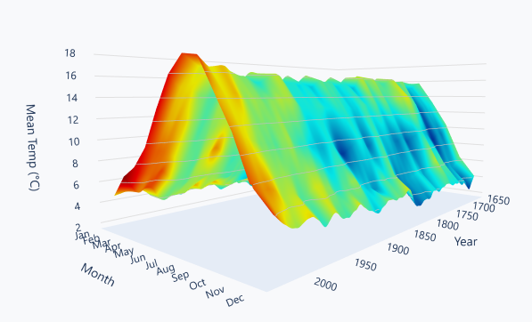
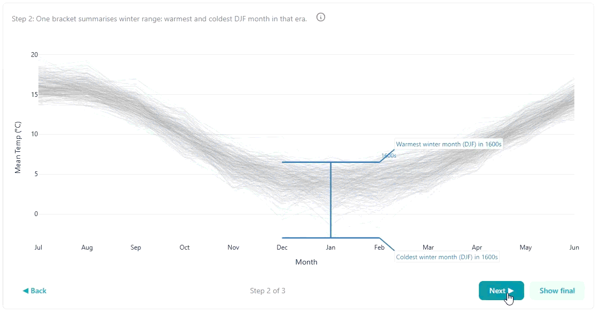

# Central England Temperature Story Dashboard (HadCET)

Interactive story-driven exploration of Central England Temperature (HadCET) monthly records, with anomaly views and LOESS smoothing.


## Quick demo




Try it locally in 3 commands:

```powershell
python -m venv .venv
.\.venv\Scripts\python -m pip install -r requirements.txt
.\.venv\Scripts\python main.py
```

Open http://127.0.0.1:8050 in your browser.

What you will see:
- Overview: 2D monthly lines plus a 3D surface of smoothed temperatures colored by anomaly
- Exceptional months: warm/cold extremes by month with timelines and rank grids
- Winter in focus: narrative, stepwise comparisons across DJF with guided controls
- Methodology: data choices, baselines, and smoothing rationale

## What this project is (and is not)

Is:
- A data-driven UI for exploring a long historical temperature series
- A structured narrative with interactive plots and annotations
- A portfolio-ready Dash app with clear scope and transparent methods

Is not:
- A climate attribution study
- A forecasting or predictive model
- A general UK climate dashboard

Interpretation is intentionally conservative; links are provided to authoritative sources for broader climate conclusions.

## Data sources and provenance

Datasets:
- HadCET monthly mean temperature (Central England Temperature), maintained by the Met Office Hadley Centre

Derived data:
- `data/processed/monthly_features.parquet` is the single artifact read by the app
- It is built from the HadCET monthly text file at `data/raw/hadcet_mean_monthly.txt` (path set in `data/config.py`)

Attribution:
- Source terms and updates: https://www.metoffice.gov.uk/hadobs/hadcet/data/download.html
- Please follow the source usage terms for data redistribution

## Core concepts (tiny glossary)

- Monthly mean temperature: The average temperature for each calendar month.
- Baseline period: A fixed 30-year reference window (e.g., 1961-1990) used to compute anomalies.
- Anomaly: Value minus the baseline mean for the same month; helps compare across seasons.
- LOESS smoothing: A local regression that reveals long-term structure; it does not predict or explain causes.
- Winter year (DJF): December is treated as part of the following winter year (e.g., Dec 1990 belongs to winter 1991).
- Exceptional months: Top N warmest or coldest months per calendar month based on anomaly vs the baseline.

## App structure / tabs

Overview
- Purpose: Provide a full-record context for monthly temperatures.
- Charts: 2D line spaghetti by month and a 3D LOESS surface colored by anomaly.
- Interaction: Highlighted year selector and range presets (modern, instrumental, full).

Exceptional Months
- Purpose: Identify the most unusual warm and cold months using a fixed baseline.
- Charts: Month-by-month rank grid and timelines of extremes.
- Interaction: Top N slider, optional anomaly coloring, and detail toggles.

Winter in Focus
- Purpose: Compare December, January, and February across eras with a guided story flow.
- Charts: Story-driven line overlays and distributions by era bucket.
- Interaction: Step controls, autoplay, and bucket sizing (auto/century/50y/25y).

Methodology
- Purpose: Document decisions and trade-offs behind the visuals and metrics.
- What it covers: Baselines, smoothing choices, data processing, and scope limits.

## Methodological choices (developer-facing)

- Monthly data: Chosen for availability and interpretability across centuries, at the cost of daily extremes.
- Baseline period: 1961-1990 is the primary climatology for anomaly plots; 1881-1910 is retained for comparison.
- LOESS smoothing: LOWESS per calendar month with frac=0.07 to show long-term structure while avoiding overfitting.
- Missing data: Monthly gaps are carried as nulls and excluded from computations rather than imputed.
- Rainfall: Ingested and stored for future extensions, but excluded from the v1 narrative to keep scope tight.

## Installation and running locally

Requirements:
- Python 3.9+ (Pydantic v2 compatible)

Setup:

```powershell
python -m venv .venv
.\.venv\Scripts\python -m pip install -r requirements.txt
.\.venv\Scripts\python main.py
```

The app runs at http://127.0.0.1:8050.

Environment variables:
- None required for v1.

Troubleshooting:
- `FileNotFoundError` for `monthly_features.parquet`: run `python -m scripts.build_monthly_features` and ensure `data/raw/hadcet_mean_monthly.txt` exists.
- Parquet read errors: install `pyarrow` and retry.
- Port in use: set `app.run(debug=True, port=8051)` in `main.py`.

## Reproducibility / data pipeline

The app reads only the processed parquet artifact. To rebuild it from raw files:

```powershell
python -m scripts.build_monthly_features
```

Inputs:
- Raw HadCET text file path is configured in `data/config.py` (default: `data/raw/hadcet_mean_monthly.txt`)

If `monthly_features.parquet` is missing, the app will fail fast with a clear error.

## Project layout

```
app_core/        theme, palette, layout helpers, app state
assets/          CSS and static assets
data/            loaders, transforms, raw and processed data
pages/           Dash pages and callbacks
scripts/         data build entrypoints
ui_components/   shared UI components
viz/             figure builders (pure-ish functions)
main.py          app entrypoint
```

## Accessibility and UX notes

- Diverging anomaly palette and recency shading aim to separate signal types clearly.
- Hover tooltips and markdown callouts reduce jargon for non-expert readers.
- Layout uses consistent section headers and narrative pacing to support scanning.

## Roadmap (v2 ideas)

- Winter frost-day proxy from daily Tmin as a companion to the DJF narrative
- Additional comparisons such as NAO index overlays
- Caching and figure memoization for faster interactivity
- Accessibility polish for color contrast and keyboard navigation

## License

Code is licensed under Apache 2.0. See `LICENSE` for details.

Data licensing:
- HadCET terms are governed by the Met Office. Please consult the source page for usage notes.

## Credits / Contact

- Anthony Cokayne: https://github.com/CatRabbitBear
- LinkedIn: https://www.linkedin.com/in/anthony-cokayne-34a719356/
- Data acknowledgements: Met Office Hadley Centre (HadCET)
- Issues and PRs welcome
